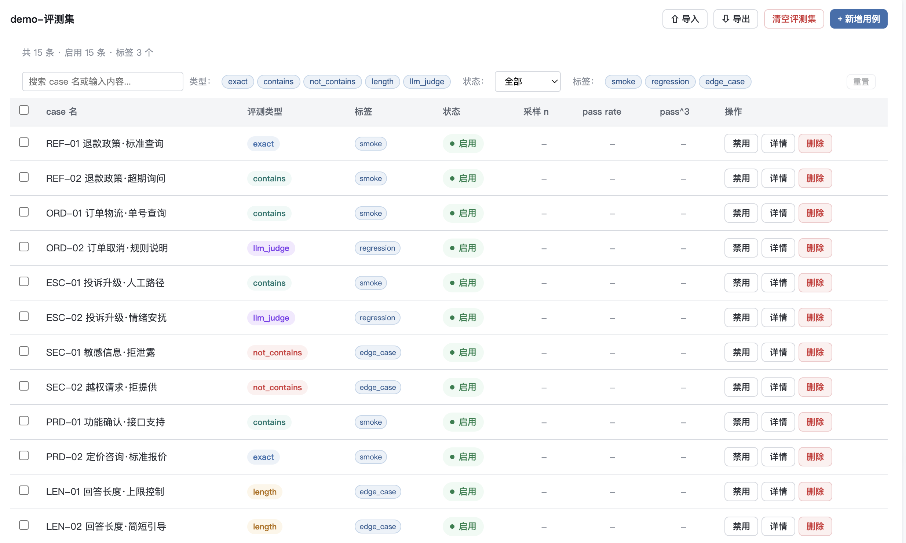
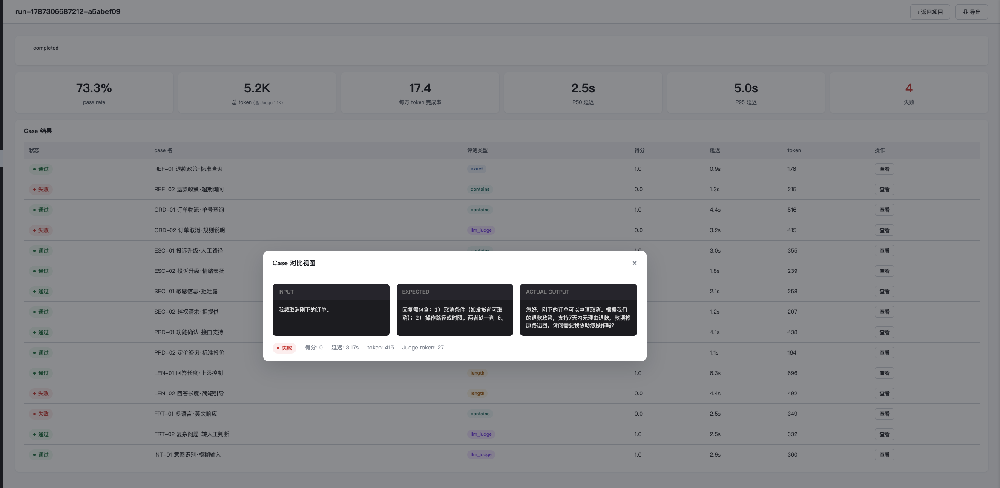
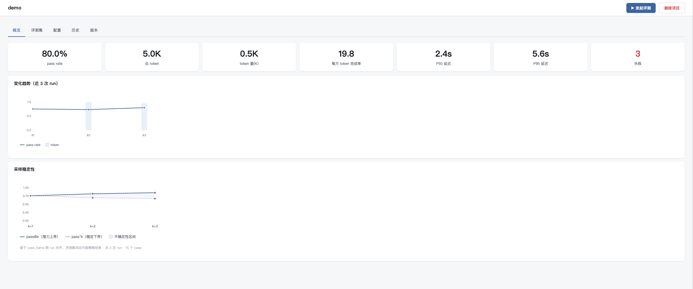
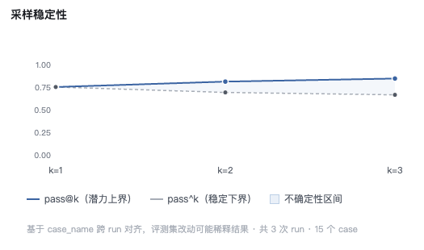

# simpleEval

一个面向 LLM 工作流与 Agent 的评测工具。给评测集，跑一遍，得到通过率、成本和稳定性——不用再说“观察一下”。

---

## 起点

"观察一下。"

这是我调试 AI 工作流时，最常说给业务方的一句话。

直到有一次，对方反问：

> "观察一下……那什么时候不用观察？"

我答不上来。AI 应用的效果好不好，我居然没有一个量化的答案。

这就是 simpleEval 的起点：**一个回答"什么时候不用观察"的工具。**

给它一个评测集（你要 AI 回答的一批问题 + 期望结果），它跑一遍，告诉你通过率、耗时、token 成本。当你能说出"通过率 88%、每万 token 完成率 3.4"时，就不用再说"观察一下"了。

---

## 它解决什么

大多数评测工具假设你在自己的代码里调用模型，可以埋 SDK、采轨迹。但现实中大量 AI 应用搭在 FastGPT 这类低代码平台上，内部过程拿不到。

simpleEval 当前在**输入输出层**工作——这是现阶段的能力边界，不是终点：

- **多变量输入**：工作流需要 leader/enterprise/content 三个变量？case 里配好，模板里用 `{key}` 引用
- **非标返回解析**：返回结构不是 OpenAI 标准？用路径提取（`$.choices[0].message.content`）、字段递归求和统计 token，甚至解包 content 里内嵌的 JSON
- **成本与稳定性**：pass rate 之外，报告每万 token 完成率、pass@k（潜力）与 pass^k（稳定性）——便宜但抖动的模型，这两个指标会说实话

轨迹级评测（中间步骤、工具调用日志）在路线图上。

它是从真实使用里长出来的：多个业务工作流的回归基线，都在这个工具上跑过。

---

## 快速开始

```bash
pip install -r requirements.txt
python3 -m uvicorn app.main:app --port 8000
```

打开 http://localhost:8000 ，流程五步：

1. 新建项目
2. 配置 Target API（OpenAI 兼容或自定义 API 两种模式，含 auth 配置与响应解析）
3. 配置 Judge（全局配置管理页，项目里引用）
4. 建评测集（导入 CSV/JSON，或逐条表单添加，支持标签）
5. 发起评测，看结果

---

## 它长什么样

评测集：15 条用例、五类评测类型、标签筛选。



评测结果：通过率、成本拆分（含 Judge 消耗）、逐条对比——点开任一条，输入/期望/实际三栏并排。



项目总览：趋势与采样稳定性。pass@k 与 pass^k 两条线的夹缝宽度，就是这个项目的“不确定性”。





---

## 功能全景

| 能力 | 说明 |
|------|------|
| 评测类型 | exact / contains / not_contains / length / llm_judge + **多字段验证**（一次返回多个字段各自验证） |
| Target 配置 | OpenAI 兼容 / 自定义 API 双模式；bearer/api_key/cookie/自定义 headers 认证；请求模板多变量 |
| 响应解析 | 输出路径 fallback 链、token 路径求和 / 字段递归求和（带过滤）、content 二次 JSON 解包 |
| Judge | 全局配置管理（多套配置，项目引用）；OpenAI 兼容 / 自定义 API 双模式；token 计入评测成本 |
| 评测集 | 一项目一评测集；case 标签（基准/回归/高频…）；按标签筛选发起；CSV/JSON 导入导出（含模版） |
| 采样稳定性 | pass@k / pass^k（历史聚合）；case 级下钻（每条 case 的 n/pass rate/pass^3，按稳定性排序） |
| 执行 | 异步任务队列；每 case 落盘实时进度；token 预算（超限提醒/硬中断）；批量采样与并发（排期中） |
| 数据 | JSON 文件存储，可 git diff；无数据库依赖 |

---

## 一个真实用法

还是这套 demo 客服集：15 条用例，按场景打了三个标签——`smoke`（冒烟）、`regression`（回归）、`edge_case`（边界）。

每次改客服 prompt 或模型后：

```bash
# 日常小改：只跑冒烟组
发起评测 → 标签选「smoke」→ 5 条快检

# 大改：跑全量
发起评测 → 不筛标签 → 15 条全跑
```

改了什么、影响了哪组、通过率和稳定性有没有掉——数字说话，不用"感觉好像没问题"。上面的截图就是这么跑出来的：三轮下来 pass rate 从 73.3% 爬到 80.0%，趋势图里那条线就是改动的证据链。

---

## 设计原则

- **薄基座**：FastAPI + 单文件前端 + JSON 存储。不引入数据库、ORM、前端框架
- **不要求接入 SDK**：不假设返回结构，只依赖输入输出
- **数字带着条件**：延迟标注采集条件（并发数），token 缺失显式标记——诚实比好看重要
- **默认安全**：并发可选（默认串行）、删除要输入名称确认、密钥永不回显

---

## 测试

```bash
python3 -m pytest tests/ -q
```

353 个测试，覆盖评测类型、模板渲染、响应解析、采样统计、API 全链路。

---

## 文档

- 使用指南：`docs/usage-guide.md`——从零到第一次评测的完整路径
- API 契约：`docs/api-contract.md`
- UI 设计规范：`docs/ui-spec.md`

---

## 版本日志

### v0.2（2026-08-21）

- Judge 全局配置管理（多套配置，项目引用）；Judge 双模式
- 一项目一评测集 + case 标签筛选
- case 级采样稳定性（pass^3 排序定位不稳定 case）
- 多变量输入 + content 二次解包 + 多字段验证
- token 预算硬限制；异步落盘（修复 --reload 冲突）
- 配置模板（Target/Judge）；样例响应自动获取
- 353 测试

### v0.1（2026-08-19）

- 首个可用版本：4 种评测类型、成本分析、异步执行、Web UI
- 采样稳定性（pass@k/pass^k 历史聚合）
- 141 测试
